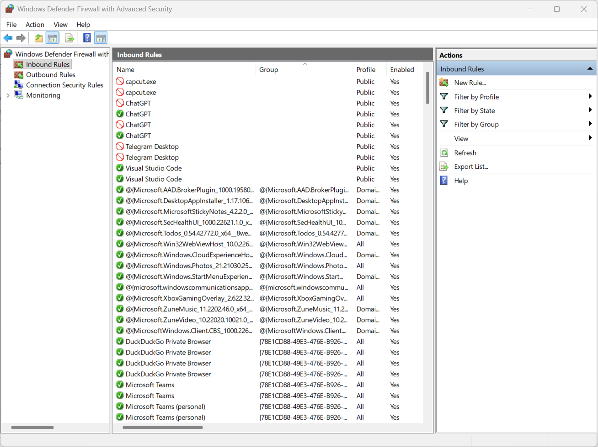
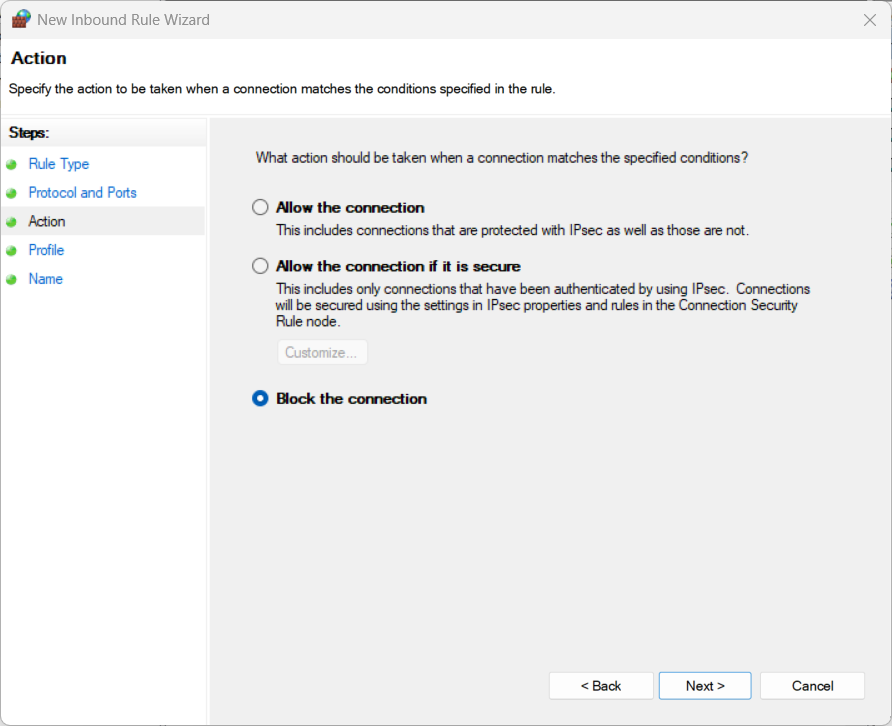
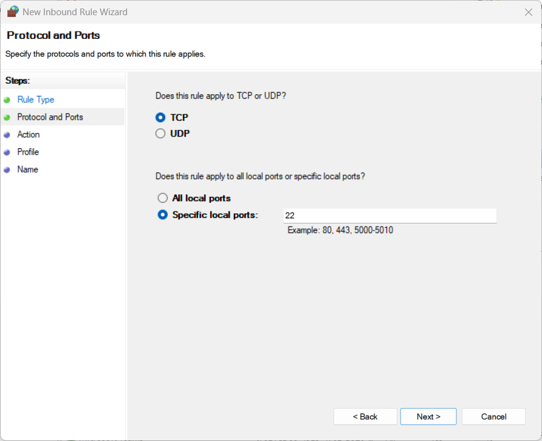
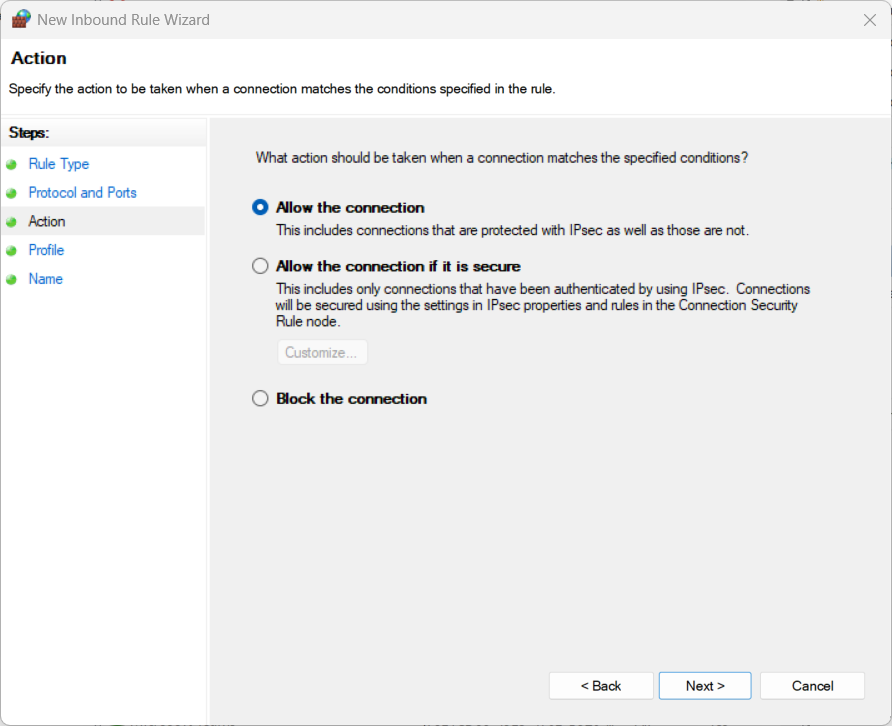
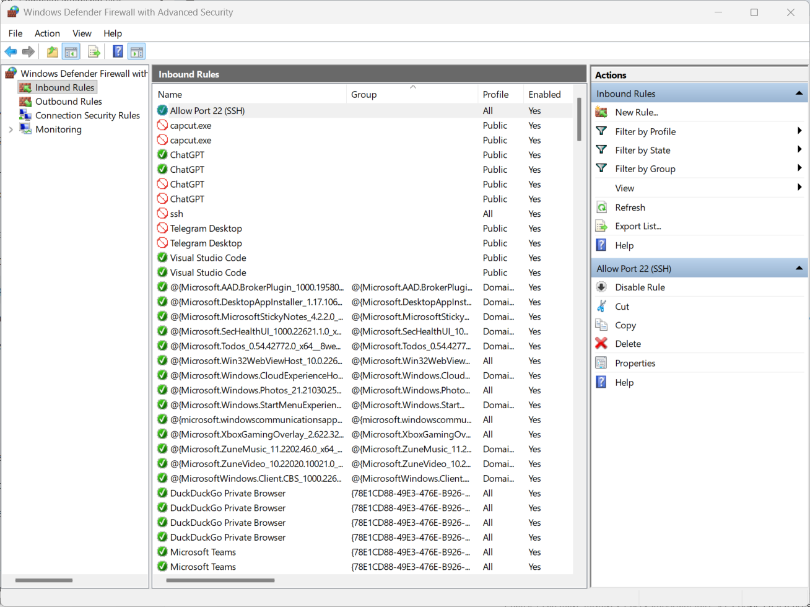

# 🔐 Cyber Security Internship - Task 4  
## Setup and Use a Firewall on Windows  

### 🧭 Objective
To configure and test basic firewall rules using **Windows Defender Firewall**, and demonstrate understanding of how firewalls filter and control network traffic.

---

## ⚙️ Steps Performed (Windows Firewall)

### Step 1: Open Firewall Settings
1. Go to **Control Panel → Windows Defender Firewall → Advanced Settings**  
   or search **"Windows Defender Firewall with Advanced Security"** in the Start menu.

### Step 2: View Existing Rules
- Click **Inbound Rules** and **Outbound Rules** on the left panel to see all configured rules.

### Step 3: Block Inbound Traffic on Port 23 (Telnet)
1. Go to **Inbound Rules → New Rule → Port → TCP**  
2. Choose **Specific local ports:** enter `23`  
3. Select **Block the connection**  
4. Apply to **Domain, Private, Public** networks  
5. Name it **Block Telnet (Port 23)** and click **Finish**

### Step 4: Allow SSH (Port 22)
1. Go to **Inbound Rules → New Rule → Port → TCP**  
2. Enter `22` for the port number  
3. Choose **Allow the connection**  
4. Apply to all profiles  
5. Name it **Allow SSH (Port 22)** and click **Finish**

### Step 5: Test the Rules
- Open Command Prompt and try:
  ```bash
  telnet localhost 23
  ```
  It should fail to connect (blocked by the firewall).

- For port 22, if you have SSH server running, the connection should succeed.

### Step 6: Remove the Test Block Rule
- In **Inbound Rules**, find **Block Telnet (Port 23)**  
- Right-click → **Delete** to restore the original state.

---

## 🧰 Tools Used
- **Windows Defender Firewall**
- **Telnet Client** (can be enabled via “Turn Windows features on or off”)
- **Command Prompt (CMD)** for testing connections

---

## 🖼️ Screenshots

1. **Inbound rules window**  
   

2. **Rule creation wizard (Port 23 blocked and Port 22 allowed)**  

   **Port 23 blocked**  
     
     

   **Port 22 allowed**  
     
   

3. **Rule removal confirmation**  
   

---

## 🧩 Key Learnings
- Understood the purpose and functionality of a firewall.  
- Learned how to add, edit, and remove inbound rules.  
- Practiced blocking unsafe ports (like Telnet).  
- Gained hands-on experience with **Windows Defender Firewall** configuration.  

---

## 🧠 Interview Questions & Answers

**1. What is a firewall?**  
A firewall is a network security tool that monitors and controls traffic based on predefined security rules.

**2. Difference between stateful and stateless firewalls?**  
- *Stateful:* Tracks the state of active connections and makes context-based decisions.  
- *Stateless:* Filters packets individually without considering connection state.

**3. What are inbound and outbound rules?**  
- *Inbound:* Controls data entering the system.  
- *Outbound:* Controls data leaving the system.

**4. Why block port 23 (Telnet)?**  
Telnet transmits data in plain text and is insecure. Blocking it prevents potential unauthorized access.

**5. Common firewall mistakes?**  
- Leaving unused ports open  
- Misconfiguring rules  
- Forgetting to apply rules to all profiles (Domain/Private/Public)  
- Disabling the firewall for troubleshooting and not re-enabling it  

**6. How does a firewall improve network security?**  
It acts as a barrier between trusted and untrusted networks, filtering malicious or unauthorized connections.

**7. What is NAT in firewalls?**  
Network Address Translation hides internal IP addresses, making the network more secure and efficient.

---
### **Author**
- **Cybersecurity Intern – Task 3** 
- Your Name : DHANUSH S 
- Date: 25 Oct 2025
---

### ✅ Outcome
Successfully configured and tested firewall rules in **Windows**, demonstrating basic **firewall management** and **network traffic filtering** skills.
